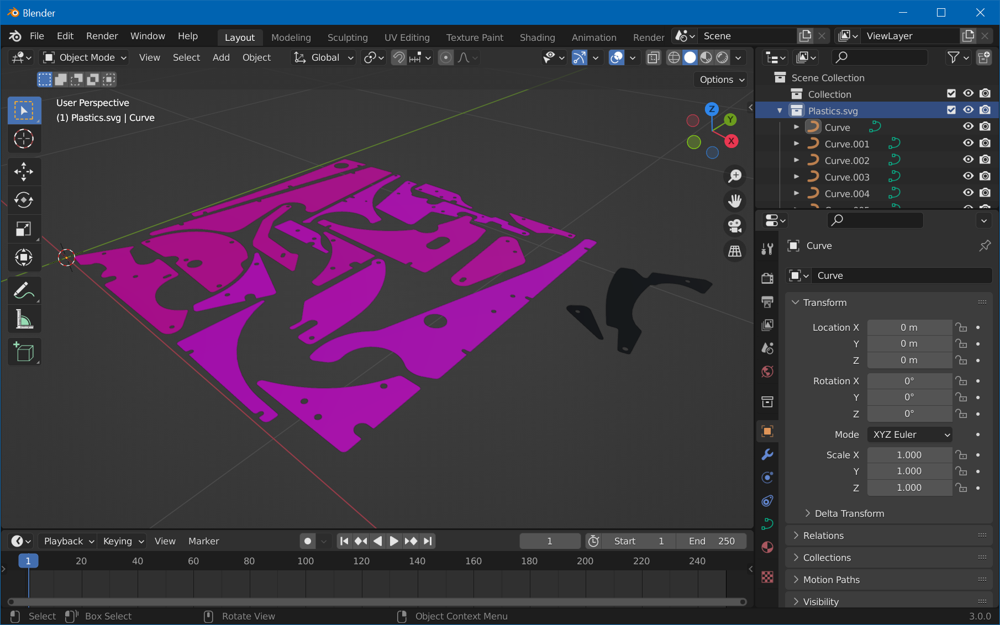

# Create Mesh

We're now going to import the SVG created in the [previous step](xref:plastics_with_blender_1) and create a mesh that is beveled on the top.

## Import

Open Blender, clear the scene with `A`, `X`, `Enter`. Then, click on *File -> Import -> SVG*, navigate to where you've saved the SVG in the previous step, select `Plastics.svg`, and hit *Import*.

You probably won't see much due to the imported size. If there were no errors, you should see your imported plastics in the Outliner. Select them and press numpad `.` to zoom in. 

> [!note]
> You might run into another issue due to the size of the plastics: Camera clipping. To fix that, press `N` with your cursor over the 3D Viewport, and set something like 0.001m for the minimal distance.

Your viewport should look like this now:

## Extrude

