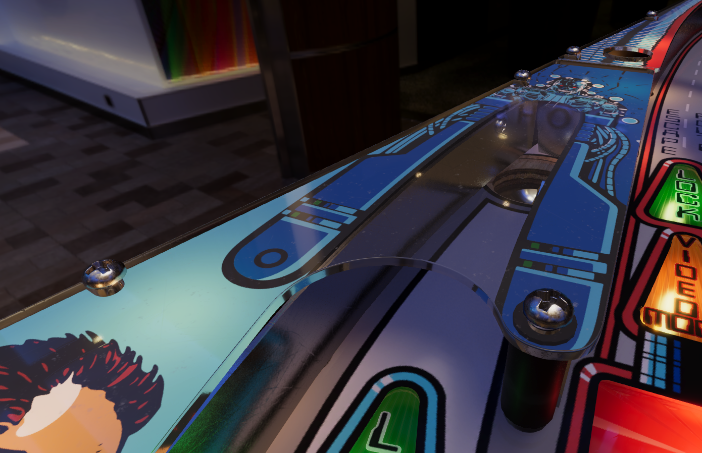

# Create Realistic Looking Plastics (with Blender)

This tutorial runs through a workflow that has been working well for us, from exporting the art from a vector graphics program like Adobe Illustrator, through creating the mesh in Blender, to importing it into Unity setting up the correct materials.

This workflow creates one single texture with all the plastics artwork, but one mesh per plastic. The final result will look like this:

1. [Prepare Artwork](xref:plastics_with_blender_1)
2. Create mesh in Blender
3. UV-map texture in Blender
4. Import mesh into Unity
