# Albedo Texture and Masks

In this first step, we'll go through how to create the various textures that we will need for the next steps.

## Texture Layout

The geometry of the playfield has three different areas:

1. The main surface, which will occupy most of our texture
2. The plywood edges, which will be re-used by all edges that we will place on the left side of the texture
3. The back side of the playfield, that is virtually invisible and mainly ignored.

While often you create your geometry first, and then map the texture onto it, we're going to do it the other way around, which is firstly defining the UV-layout, and then extruding the geometry based on that. This will give us perfectly accurate mapping.

The best way of doing this is to load your playfield scan, extend the canvas to the left, add the plywood texture, and save the result to a new file. 

So let's start!

## Albedo Texture

We start by creating a plywood texture for the edges. Check the dimensions of your playfield scan, and create a new file with the same height (it's 6750 pixels in our example). Then, get a photo from the edge of some plywood, copy it a few times to get the whole height, and paint on a mask to make the copies seamless. Add some contrast if necessary and save it as `plywood.png`.

<small><i>The plywood edge texture. Get the original [here](plywood.png) or an alternative [here](plywood2.jpg).</i></small>

Then, open your playfield scan in Photoshop. Use the crop tool to extend the canvas to the left, with the width of your plywood texture. Copy the plywood texture next to the playfield. Verify that its width more or less corresponds to the playfield size, otherwise it'll be skewed.

> [!note]
> Tip: When cropping, make it too large. Then, paste the plywood next to the playfield, and crop it back to the plywood's border.

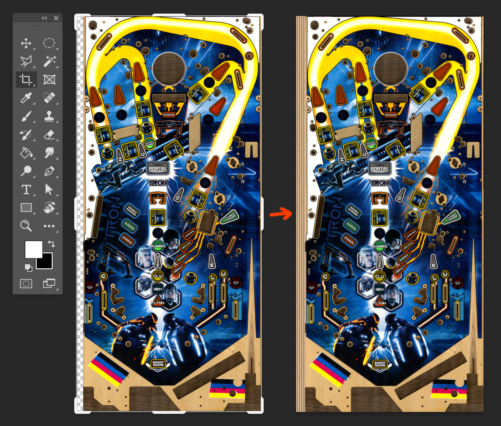

Go ahead and save this texture as `albedo.png`.

## Wood Mask

Now we'll be creating a mask that we'll export as PNG for Substance, but also as SVG so we can extrude it in Blender.

Open Adobe Illustrator. Create a new document, and import `albedo.png`. Resize the artboard to the exact size of the imported image (enable *View -> Smart Guide* to make Illustrator snap to edges). Name the layer *reference* and lock it.

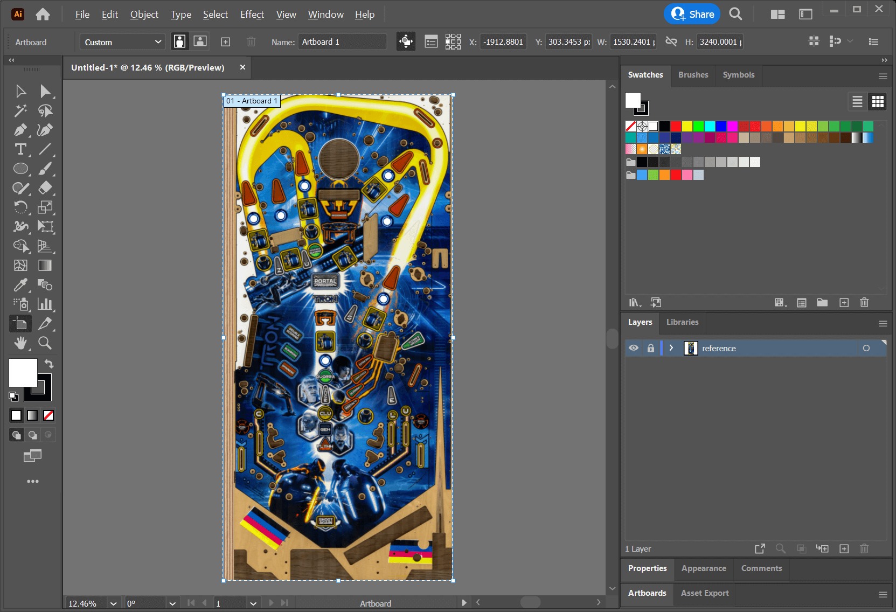

Create a new layer, name it *wood mask* and draw solid shapes that cover the visible holes. This includes insert holes, but also holes for lamps and triggers that aren't entirely covered by another object.

Here a few tips that will probably make your life easier.

- Click on the small circle right to the *wood mask* layer, and set the opacity to 50%. This way, all elements in that layer are semi-transparent, allowing you to align your edges much better.
- Disable smart guides (`Ctrl+U`). It's much less annoying when you manipulate the curves.
- Use the corner feature. Specially for inserts, draw pointed corners and use the rounded corner tool to round them off. You can do this for each corner individually.
- Try to get a shot of the real playfield's back side. It gives you a better idea how narrow the inserts are cut. Often, the printed border of the insert overlaps with the hole.
- If you're unsure whether a hole will be visible or not, draw it. Polycount isn't as important in modern engines, and it'll save you a lot of time.

Finally, your mask should look something like this.

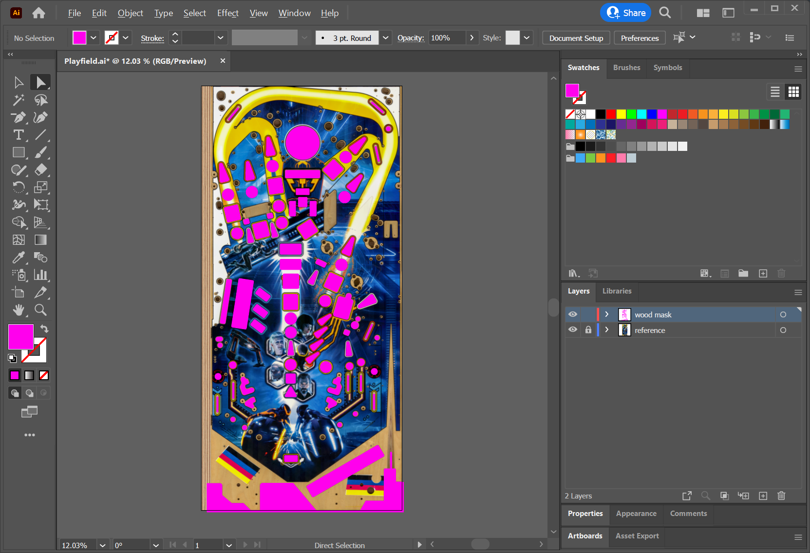

Now, we'll need the inverse shape of what you've just drawn. So, create an new layer, call it *masks*, and draw two rectangles: One that covers the playfield, and another that covers the plywood (turn *Smart Guides* back on for this, and make sure to snap to the edges of the artboard). Color them differently and name them *full* and *plywood*. Duplicate *full* by hitting `Ctrl+C` and `Ctrl+F`. Hide the copy, and lock the *masks* layer so only the *wood mask* layer is unlocked.

Hit `Ctrl+A` to select all the wood mask shapes, and duplicate them with `Ctrl+C`, `Ctrl+F`. Unlock the *masks* layer, shift+select the *full* rectangle, open the *Path Finder* tool and hit the *Minus Front* button. Select the *masks* layer, right-click on the selected shape, and click *Arrange -> Send to Current Layer*. Rename the new object `<Compound Path>` to *wood*. Hide the *reference* and *wood mask* layer.

The result should look like this:

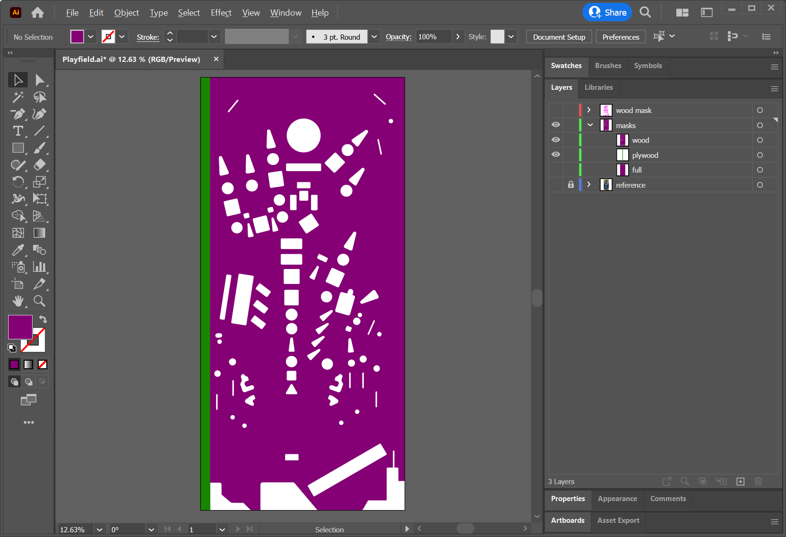

Export this as a **black on white** PNG: Hide *plywood* and fill *wood* black. Click on *File -> Export -> Export As*, choose type PNG, check *Use Artboards*, and name it *wood-mask*. Under *Resolution*, choose something that is at least as large as your albedo (if you haven't resized the playfield scan after pasting into Illustrator, 72dpi will correspond to the original resolution). Set the *Background Color* to *White*.

## Insert Mask

Before we export the playfield as SVG for Blender, we need to create the polygons that are placed over the inserts, so we have something to render the ink on. We still have our *wood mask* layer, so hide everything else but this and the *reference* layer. 

Drag and drop the *wood mask* layer onto the "plus" icon at the bottom of the *Layers* panel to duplicate it. Name it *insert mask*. Hide *wood mask*, and delete all polygons that haven't anything printed on it. For Tron, it looks like that:

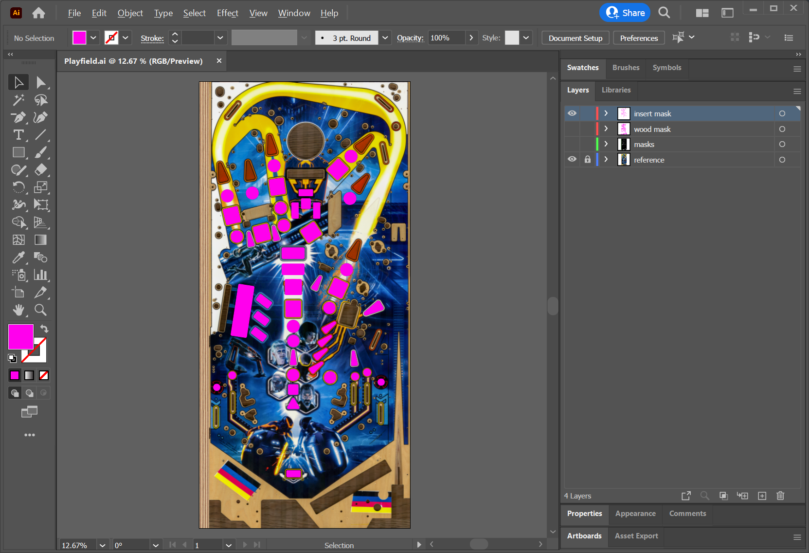

Now we have everything we need for the playfield mesh. Hide the *reference* layer, unhide the *masks* layer (with both *wood* and *plywood* visible), hit `Ctrl+A`, `Ctrl+C`, *File -> New -> Create*, `Ctrl+F`. Then, resize the artboard so it fits the content. *File -> Save A Copy*, choose type *SVG*, and name it `playfield.svg`. In the *SVG Options* dialog hit *More Options* and uncheck everything. Also, set *Decimal Places* to `5`.

> [!note]
> The reason of doing it this way is that when "exporting" instead of "saving a copy", Illustrator saves the file differently, which often ends up in an erroneous import in Blender. *Save A Copy* also saves hidden layers which we don't want, that's why we create a new document.

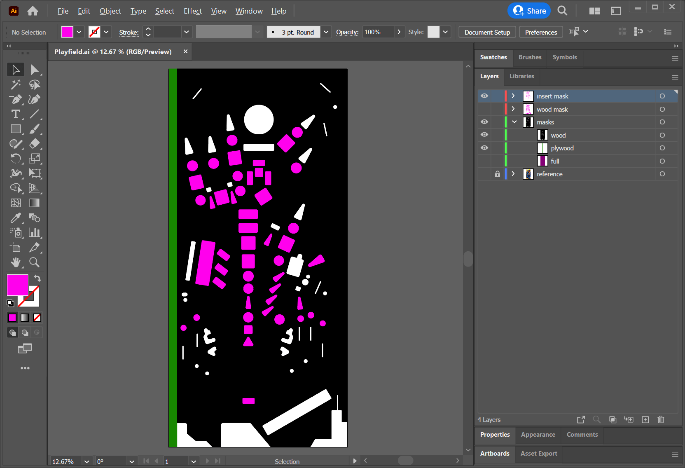
<small><i>These three layers are exported as SVG.</i></small>

## Ink Mask

Next up is a mask that will allow us to differentiate between the ink, the wood and the alpha channel above the inserts when creating the material. If your playfield has absolutely no visible wood, just mask out the inserts. But chances are that it has, specially inside the slingshots and around the triggers. 

Create a new layer and name it *ink mask*. Draw shapes around everything that is *not* ink. This includes wood, inclusively any holes, and the part of the insert drawers that aren't printed on. Close up, it looks like this:

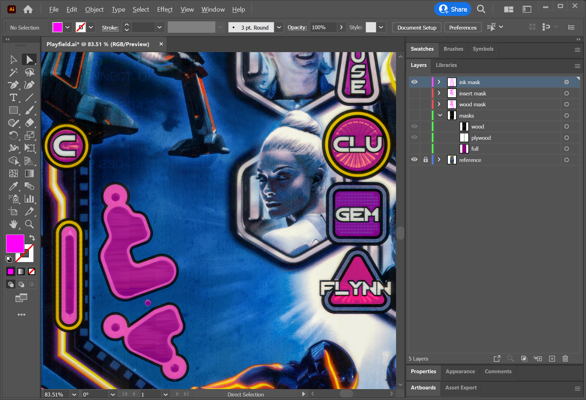

Once you're done, export it as a **white on black** PNG: Make all shapes white, *File -> Export -> Export As*, name it `ink-mask.png`, don't forget to check *Use Artboards*, and choose black *Background Color*. This is how it looks for Tron (black background added for illustration purpose):

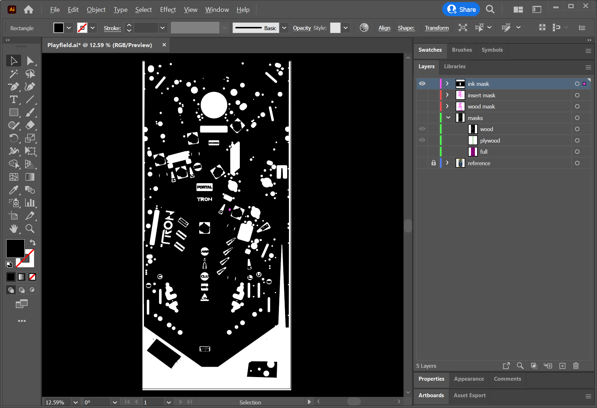

## Fake Holes

Since we will not physically cut out *all* holes into the playfield mesh, there will be many smaller and some bigger holes where posts, pins, screws, wire guides, bumpers, and other things are attached to. Sometimes they are even visible, but not recognizable as a full-featured hole.

Masking those elements out allows us to use a proper height map later when creating the materials. It also allows us to replace the scanned wood with a high quality material, and still be able to exactly know where to position elements on the playfield.

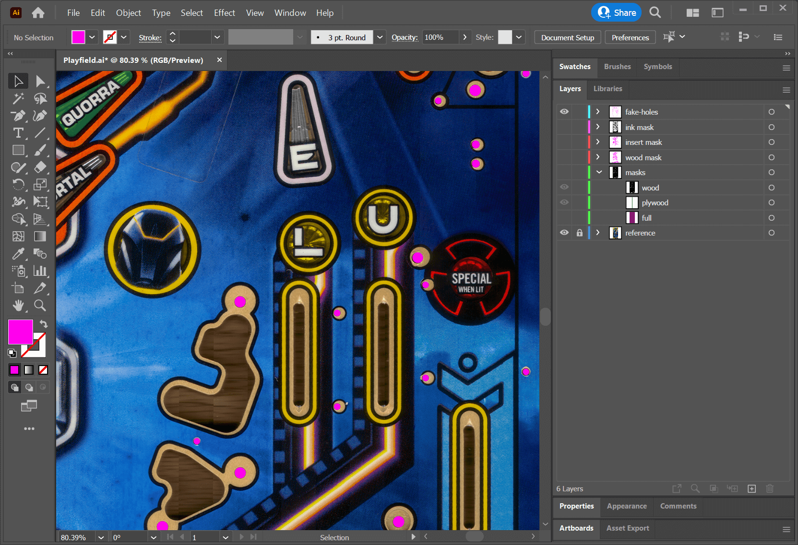

Once you're done, like the ink mask before, export this as a **white on black** PNG and name it `fake-holes-mask.png` (don't forget to check *Use Artboards*).

## Other Masks

Tron has two special features: Mylar stickers to protect the playfield, and the Limited Edition has silver ink around the inserts. We'll draw those as well and export the masks **white on black** as `mylar-mask.png` and `silver-mask.png`.

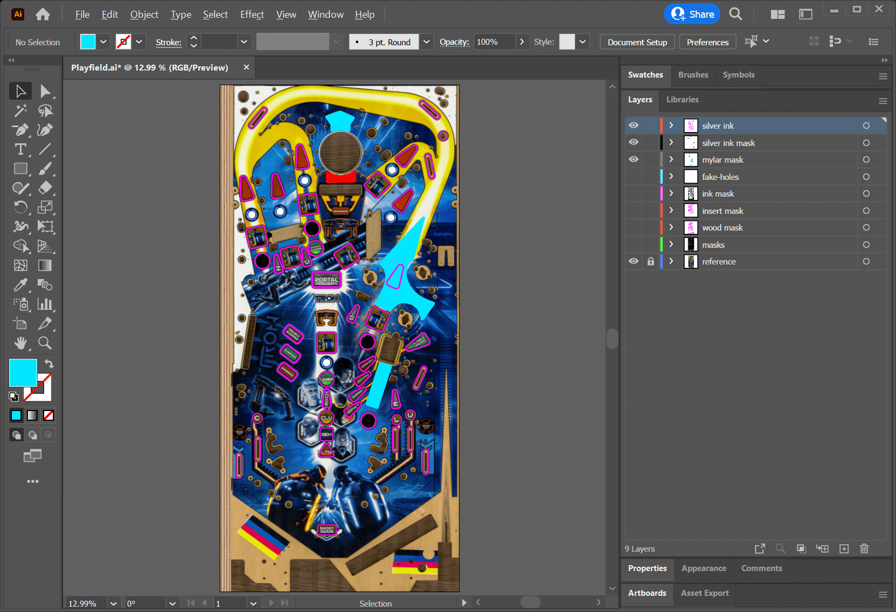

The reason to mask out both of these features separately, is that we can create special material properties in Substance Painter later. For example the silver layer will have a much smoother surface than the ink, while being metallic, and the mylar layer will have a different height and roughness.

## Conclusion

To wrap up, we've now created an albedo texture and several masks that will allow us later to texture the playfield. This is how our folder looks now:

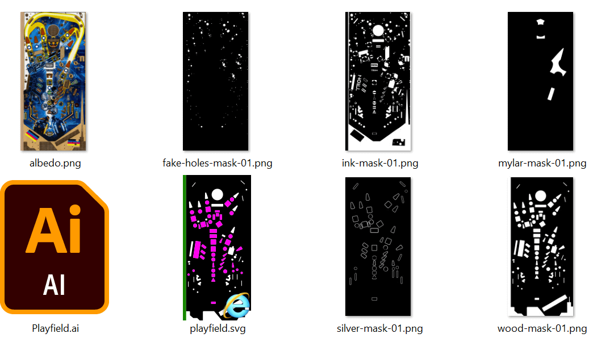

This concludes our time in Illustrator. Let's close it and continue with Blender in the [next step](xref:tutorial_playfield_2).