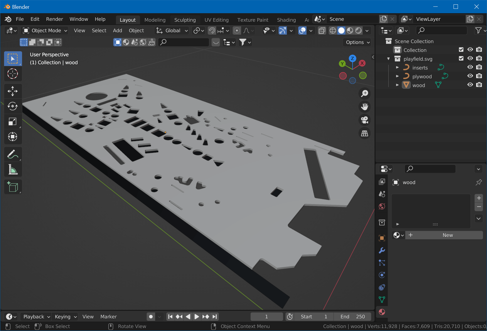
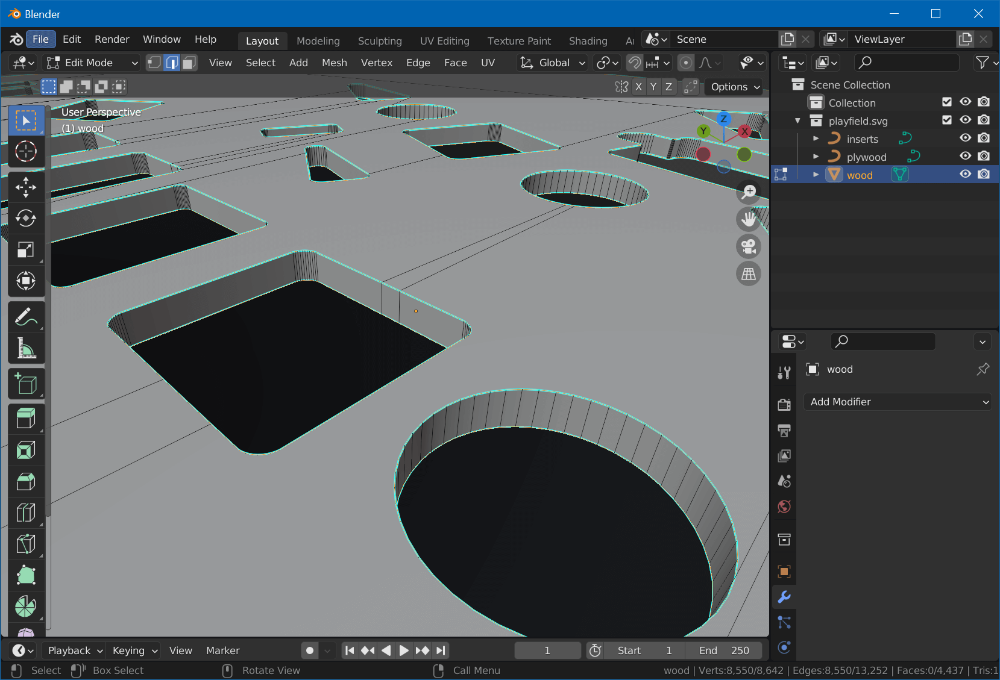

# Create the Playfield Mesh

## Import the Shapes

Open Blender. Delete everything (press `A`, `X`, `D`). Click on *File -> Import -> Scalable Vector Graphics (.svg)* and choose `playfield.svg` that you have exported in the last step. Select *wood* in the outliner, move your cursor over the viewport and hit `numpad 0` (zoom in on selected), `numpad 7` (top view).

If you haven't grouped your inserts, you'll have a bunch of Curve objects. Select them all and hit `Ctrl+J` to join them. Rename the object to *inserts*. Hit `A` and choose *Object -> Set Origin -> Origin to Geometry*. You should see something like this:

Make sure that all three shapes (inserts, plywood and wood) are there.

## Extrude

Select the *wood* object. Under *Material Properties*, remove the `SVGMat` material so we better see the shape. Convert the shape to mesh by choosing *Object -> Convert To -> Mesh*. Hit `tab` for edit mode, `A` to select all, then clean up the mesh by going to *Mesh -> Cleanup -> Limited Dissolve*, followed by `M` and *By Distance* (merge by distance).

Hit `E` to extrude, and eyeball it to something more or less accurate (you can of course always measure and type in the number). Hit `tab` to go back to object mode.

## Smooth

Since our cuts are round, let's smooth out the mesh. Select *Object -> Shade Smooth*. Don't panic, we'll fix the normals. Switch to edit mode (`tab`) and select one of the top faces. Hit `Shift+G`, *Coplanar*. While holding `shift`, select a one of the bottom faces. Again `Shift+G`, *Coplanar*. `Ctrl+I` to invert selection. *Select -> Select Loops -> Select Boundary Loop*. You now have all edges of the inserts as well as the outer borders selected.

Make these edges sharp by selecting *Edge -> Mark Sharp*. Hit `A` to select all and choose *Mesh -> Normals -> Reset Vectors*. You should how have a mesh with a flat, uniform top and smooth inserts.

Maybe now it's a good time to save your project. Name it `Playfield.blend`.

## Convert Other Objects

We don't need to extrude the other objects, just convert them to a mesh so we can UV-map them. Exit edit mode with `tab` and select the *inserts* object. Remove `SVGMat`, select *Object -> Convert -> Mesh*, and hit `tab` for edit mode.

Press `A` to select all, *Mesh -> Cleanup -> Limited Dissolve*, and `M`, *By Distance*. Exit edit mode by pressing `tab`. Since we extruded to the top, we need to align the *inserts* mesh. Hit `G`, `Z`, and type the distance you used to extrude.

Finally, select the *plywood* object, remove its material and convert it to a mesh as well. The result should look like that:

