# Texturing

We'll be creating a rather sophisticated material for our playfield. There will be a bunch of different materials, which altogether will result in a PBR texture set that we can use in Unity.

Start up Substance Painter. Select *File -> New* and use the *PBR - Metallic Roughness Alpha-blend* template. Set the document resolution to 4096 and select the FBX file exported from Blender. Save your project as `Playfield.spp`.

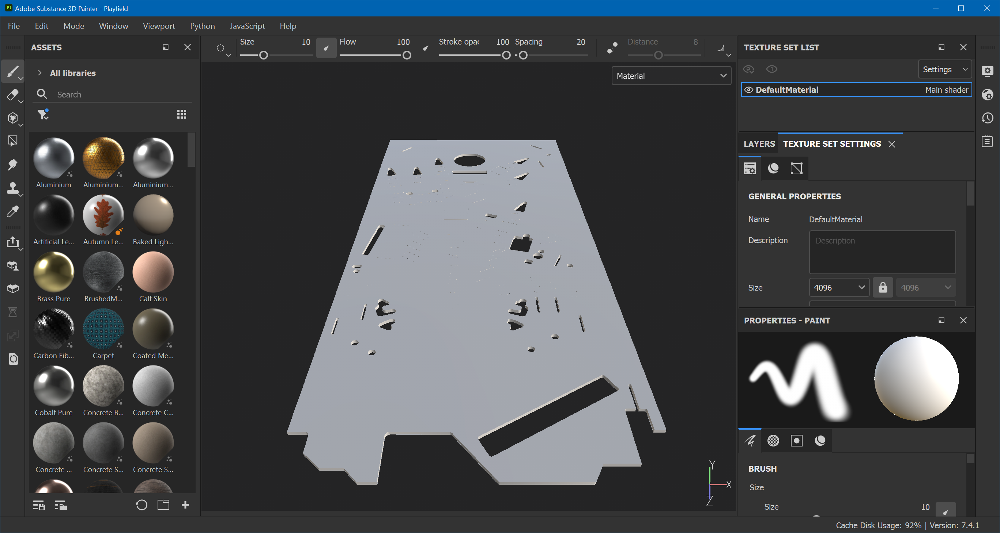

> [!note]
> We don't need any baking in this tutorial, so we'll skip it to keep the file size smaller. However if you would use any smart materials in your texturing, baking at least the curvature map and thickness map is required for the material to work correctly.

## Setup

Let's start by masking out the top surface and the plywood edge. Under *Layers*, delete *Layer 1* and create two folders. Name them *Edges* and *Surface*.

- Right-click on the *Surface* layer and choose *Add white mask*
- Hit `F1` to see both the 3D view and UV tile
- Select the [Polygon Fill tool](https://substance3d.adobe.com/documentation/spdoc/polygon-fill-34275386.html)
- Set the color under *Properties* or in the top toolbar to black
- Draw a rectangle over the UV tile's left border to fill the edge polygons
- Alt-click on the mask to verify that only the left border is black:
  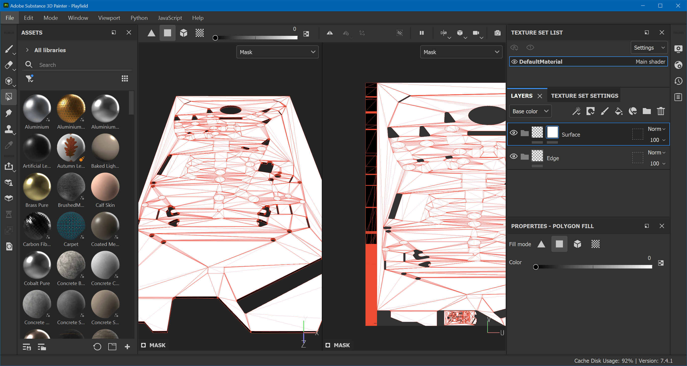

Do the same for the *Edges* layer, but invert the mask:

- Right-click on the *Edges* layer and choose *Add black mask*
- Set the color to white
- Draw a rectangle over the UV tile's left border to fill the edge polygons
- Alt-click on the mask to verify that only the left border is white:
  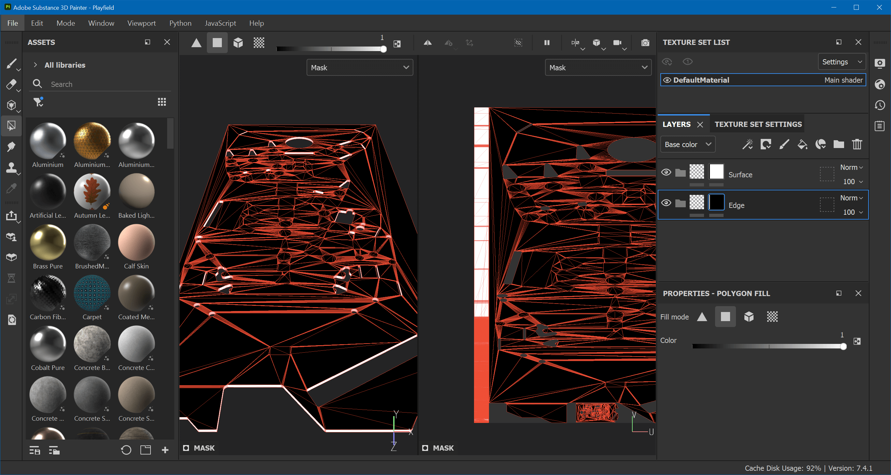

Hit `F2` to show the 3D view only, and switch back from *Mask* to *Material* in the drop-down of top right corner.

## Ink Material

Create a new folder inside of *Surface* and call it *Ink*.

### Albedo

Inside of *Ink*, create a fill layer and name it *Albedo*. Under *Properties*, `Alt`-click on *color* to make it albedo only. Grab `albedo.png` from your file system's explorer and drag and drop it into the *Assets* panel (on the left side). 

In the import dialog, click on *undefined* and select *texture*. At the bottom select to import to *project 'Playfield'*. Drag *albedo* from the assets panel into the *Base color* channel of the *Albedo* layer. Finally, right-click on the layer and select *Add anchor point*.

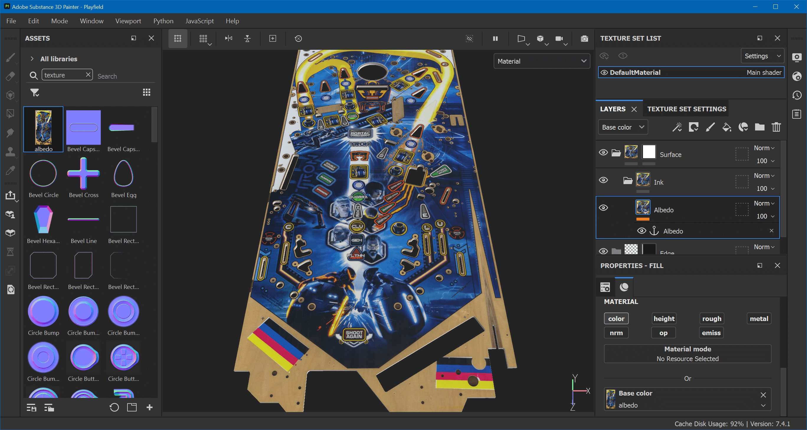

### Height and Roughness

We're going to stack three effects on top of each other:

1. In a CMYK printing process like a playfield, each color gets applied on top of each other. What we can do to mimic this effect is to grab the grayscale image of the albedo and interpret it as height map, where black is highest and white lowest.
2. Ink is never applied perfectly evenly, so there are little bumps that should be visible.
3. A playfield that has been in use has micro scratches from the ball.

But first, let's set the base values. Just above the *Albedo* layer, create a new fill layer and call it *Base Height/Roughness*. Under properties, `Alt`-click on *height* and click on *rough*. Set the height to `0.004` and the roughness to `0.15`.

#### Noise and Scratches

Now we're going to add another layer that contains the ink imperfections and the micro scratches.

- Add a new layer above *Base Height/Roughness* and call it *Wear*.
- In the *Properties* panel, `Alt`-click on *height* to make it only affect the height.
- Set `Height` as uniform color to `-0.1`.
- Right-click on the layer and add a black mask.
- Add a fill effect to this mask and call it *Noise*.
- Click on *grayscale* and search for *Fractal Sum 1*.

Zoom in a bit and use `Shift`+`Mouse Right` to rotate the environment map. Move the light source in front of you so you see the reflection the height is causing.

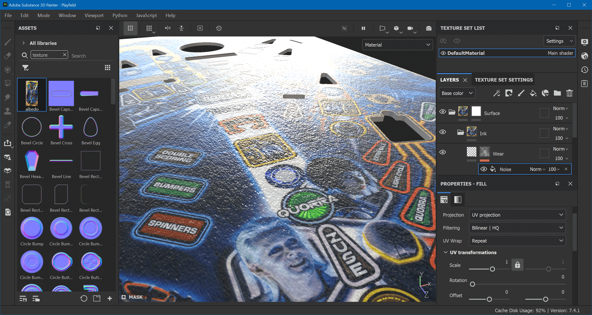

Now, this is way too much noise, but it allows us to tweak it better before we tune it down. The first thing to do is not to UV-project, which is the default. In general, you should only UV-project when you know that the aspect ratio of your UV mapping is correct, which isn't the case here.

So, the *Noise* effect still selected, change the *Projection* under *Fill* to *Tri-planar projection*. You'll immediately notice how the noise is less skewed.

Then, the size of the bumps is way to high as well. Still under *Properties*, look for *UV transformations*, and set the scale to `5`. Finally, make the effect more subtle by selecting the *Wear* layer (not the mask), and changing the *Height* at the bottom of *Properties* from `-0.1` to `-0.01`.

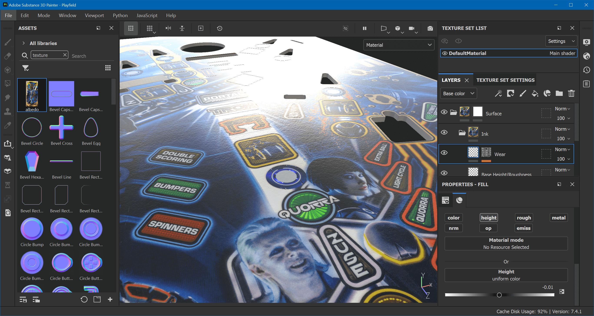

That's better. Now let's add some scratches. Click on the mask of *Wear* again, and add another fill effect, above *Noise*. Call it *Scratches*. You'll notice that this makes the noise disappear, but that's fine for now. Under *Properties*, change the *Projection* to *Tri-planar projection* like before.

Click on the *grayscale* button and search for a texture named *Grunge Scratches*. You'll notice that the scratches now actually pop up instead of going down. Let's fix that by setting *Invert* to *true* down under *Parameters*.

In order to get the noise back, change the blend mode of *Scratches* to *Linear Dodge (Add)*. Use the slider just besides to make the effect more subtle. Do the same for the *Noise* effect until you're happy with it. 

Here, it looks good with *Noise* at `70` and *Scratches* at `40`. You can always tweak this later.

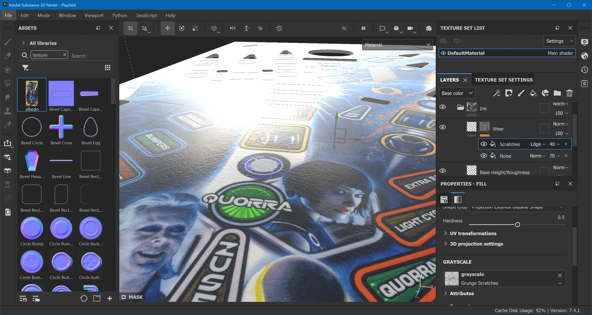

#### Ink Height

Create another fill layer above *Wear* and call it *Ink Height*. `Alt`-click on *height* to make it height-only and set the height to `-0.1`. Right-click on the layer add a black mask. Add a fill effect to the mask and name it *Ink Alpha*.

Click on *grayscale* to select a texture, switch to the *Anchor Points* tab and select *Albedo*. Again, much too high, so select the layer again and dial in the height. Here, it looks good around `-0.0088`. Subtlety is key.

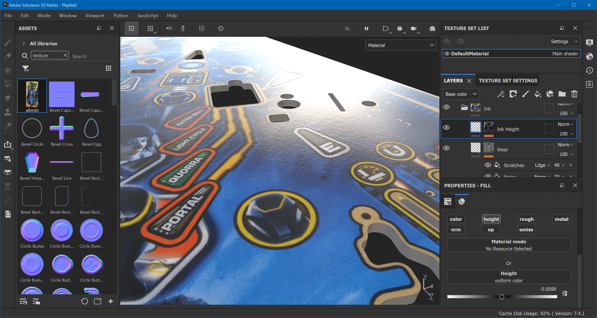

## Wood

Having created an ink mask allows us to use a proper wood material for what's below the ink. Under the *Ink* layer, add a new folder called *Wood*. 

Now, a good wood material that works well for playfields is titled "Oak Wood" by Casimir Perez. It's part of Adobe's free Substance materials, and you can download it [here](https://substance3d.adobe.com/community-assets/assets/75c37499062d5198057e10751fc6fdb3ca26ab20). 

After downloading, drop it into the library and from the library into the *Wood* folder. Hide the *Ink* layer so we can parameterize it correctly. I've found the following setting to work well:

- Projection: Tri-planar projection
- Scale: `5`
- Rotation: 90°
- Color: `#CC9166`
- Roughness: 0.18

Also, hit *Random* a few times if you don't like the pattern.

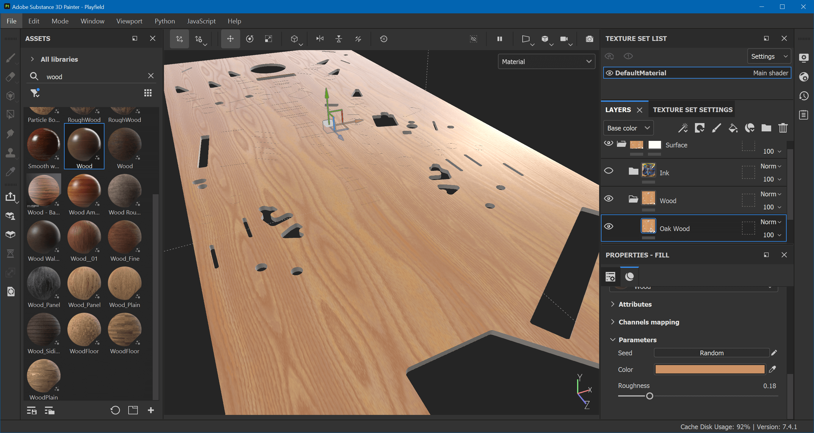

Let's mask this out, since we don't want any of the channels influence the ink, and we don't want wood under the meshes that covers the inserts either. Right-click on the *Wood* folder, add a white mask with a fill effect named *Wood Mask*.

Drag and drop `wood-mask-01.png` into *Assets*, import it as *alpha* into *project 'Playfield'*. Then drag the imported texture on *Wood Mask*'s grayscale. This does the inverse of what we want (i.e. it shows the wood only over the inserts). To fix this, right-click on *Wood Mask*, choose *Add filter*, click on *filter*, and choose *Invert*.

Now we have masked out the inserts, but we still have wood over the ink. To fix this, create a new fill effect above the *Invert* filter, name it *Ink Mask*, import `ink-mask-01.png` and assign it to the fill effect. Select the blending mode to *Multiply*.

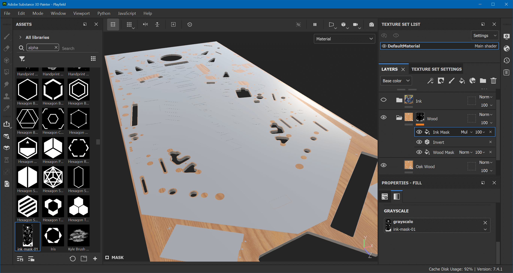

In order to make the wood visible below the ink, do the following:

- Re-enable the *Ink* layer
- Add a white mask to the *Ink* layer
- Add a fill effect called *Ink Mask* to the mask
- Click on *grayscale* and search for *ink-mask-01*.
- On top of *Ink Mask*, add an *Invert* filter

Your playfield should now have the ink properly masked out and sitting on top of the wood.

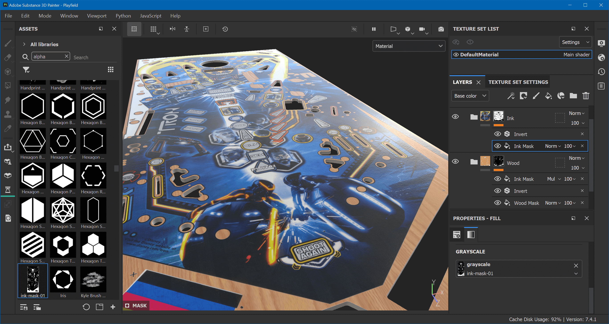

## Inserts

Let's look at the inserts. What we want is to apply our ink mask as an alpha mask on the insert meshes. Create a new folder layer above *Ink* and call it *Inserts*.

Add a white mask and a fill effect called *Wood Mask*. Click on *grayscale* and search for *wood-mask-01*.

Within the *Inserts* folder, create a new fill layer and name it *Opacity*. `Alt`-click on *op* under its properties to only activate the opacity. Set the opacity to `0`.

Right-click on the *Opacity* layer, add a white mask with a fill effect named *Ink Mask*, and set the fill effect's grayscale to *ink-mask-01*.

Unfortunately, this results in edges around the ink over the inserts, since the albedo below has been masked out by the wood mask. In order to fix that, add another fill layer below *Opacity*, make it *color* only, and assign the *Albedo* anchor point to its color.

This should make the insert overlay to be cut out correctly.

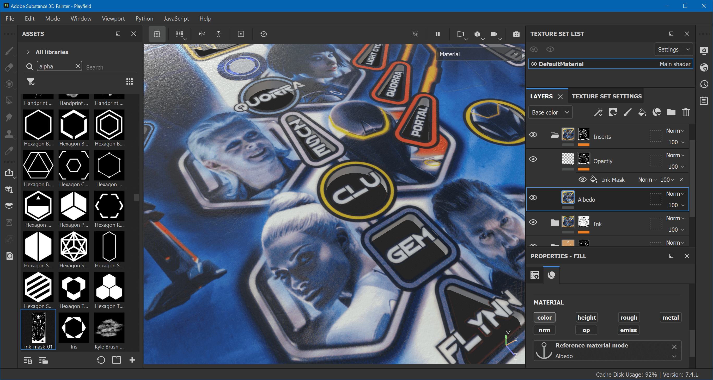

## Fake Holes

Remember the fake holes mask we've created so we can use them as markers on the playfield? Let's do those. Create a new folder layer above *Inserts* called *Fake Holes*. But before we add anything to it, we need to mask out a few things.

Click on the mask of your *Wood* folder, where the *Ink Mask* is the top effect. Add another fill effect called *Fake Holes Mask*. From your file explorer, drop `fake-holes-mask-01.png` and import it into your project as an alpha. Assign it to the *Fake Holes Mask* fill effect, and set the blend mode to *Subtract*.

You should now see gray spots in your wood. Go back to your new *Fake Holes* layer, and add a white mask with a fill effect called *Fake Hole Mask*. Click on *grayscale* and find *fake-holes-mask-01*.

In the *Fake Hole* folder, add a new fill layer and call it *Material*. Only enable *color*, *height* and *rough* on it. Set the color to `#050505`, the height to something like `-0.08`, and roughness to let's say `0.7`.

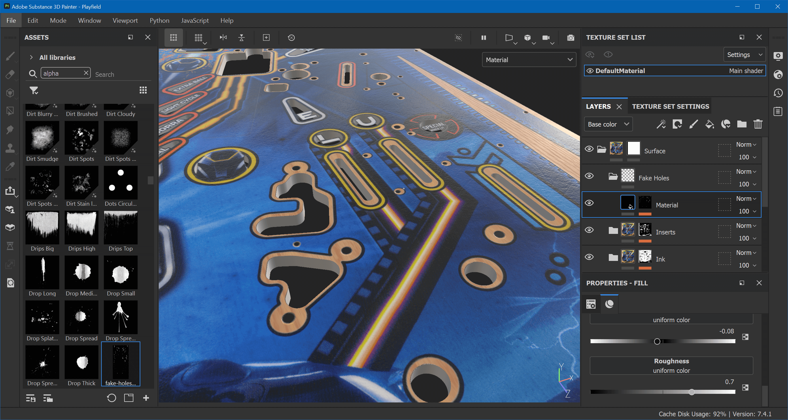
<small><i>Which holes here are fake?</i></small>

## Edges

We have ignored the edges so far. Create a new fill layer under the *Edge* folder. Name it *Albedo* and `Alt`-click on *color* to make it color-only. Click on *Base color* and search for *albedo*. This will directly apply the texture as you have mapped it in Blender.

If you want to align the mapping, hit `F2` to see the mapping on the UV tile, which allows you to resize and move the texture. You could also use a completely different texture of course.

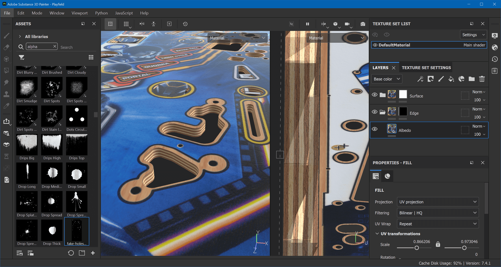

## Plunger Lane

One of the drawbacks of replacing the scanned wood with a material from Substance Painter is that the plunger lane which is typically cut into the wood, becomes invisible. So let's add this back.

Just above the *Wood* folder, create a new folder layer called *Plunger Lane*. Inside, add a new fill layer and name it *Albedo*. Make it *color* only, click on *Base color*, search for *albedo*, and choose your previously imported playfield scan. Now we have the scan replacing all our wood, which we don't want.

Right-click on the *Albedo* layer and add a black mask. Right-click on the mask and add a paint effect. With the brush tool, use a soft brush to draw back the plunger lane of the original playfield scan. Use `X` to swap between painting black and white. After masking, it should look similar to this:

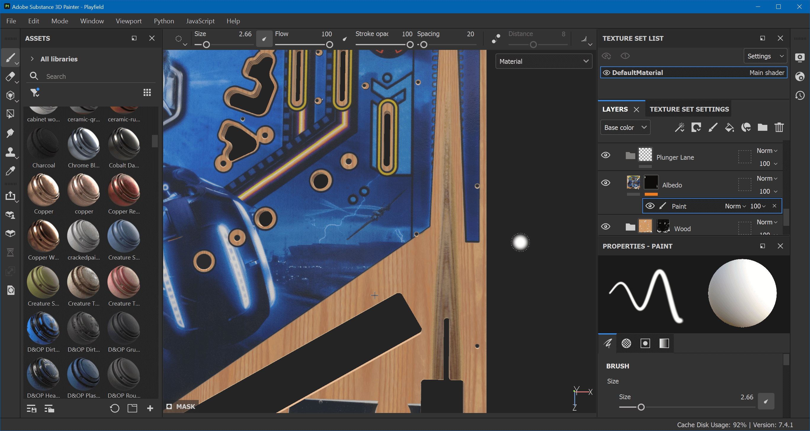

Now, this doesn't really match the surrounding colors. Click on the left preview icon of the *Albedo* layer, right-click and select *Add filter*. Click on *Filter* and look for *Color Balance*. Manipulate the parameters so they colors match the surrounding wood. Then, add another filter, select *Color Correct*, and adjust the parameters to further improve.

Finally, if you see that your scan is softer than the generated wood, add a *Sharpen* filter to compensate. The final result here looks like this:

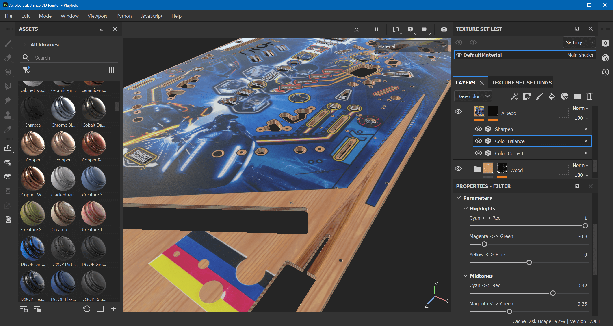

Let's also add a proper height map. I've simply drawn a triangle on the lane and exported it as PNG ([download](plunger-height.png)). Above the plunger lane's *Albedo*, create a new fill layer named *Height*. `Alt`-click on *height* to make it height only. Right-click on the layer, add a black mask with a fill effect. Import `plunger-height.png` and assign it to the fill effect. 

Set *UV Wrap* to *None*. `Alt`-click on the mask icon of the layer to visualize it, select the *Fill* effect again and hit `F1` to place the texture over the plunger lane. On top of the fill effect, add a filter effect and select the *Blur* filter. Adjust it so it blurs similar to this:

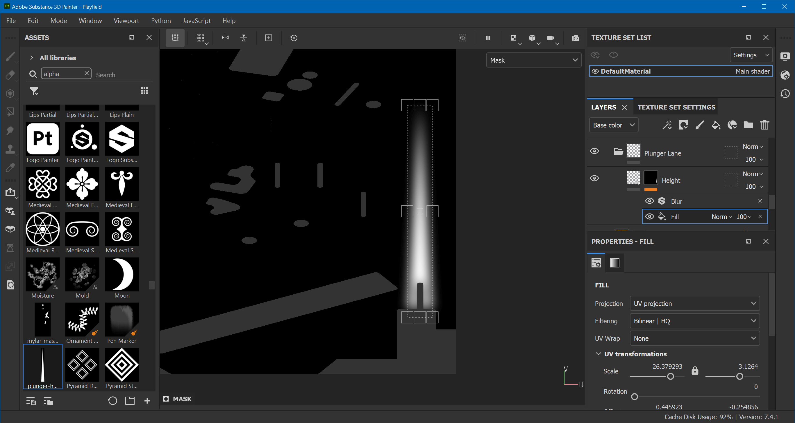

Hit `F2` and set the viewport from *Mask* back to *Material*. Play with the layer's *Height* while rotating the environment lights until you're satisfied. You can also go back to the mask and adjust the amount of blurring. 

## Wrapping Up

This tutorial is already long enough, so we've created a [separate page](xref:tutorial_playfield_3b) for dealing with our Mylar sticker and silver paint. Here, we're going to wrap up and get this exported. But first, there is one last thing we need to do, which is making sure our material is PBR valid.

PBR valid basically means that the color of your textures aren't too light or too dark. There is no such thing as absolute black in the nature, and if we provide such values, there will be problems when rendering later. More literature about this can be found [here](https://substance3d.adobe.com/tutorials/courses/the-pbr-guide-part-2) under "Base Color (RGB – sRGB)".

Download the free ["PBR Validate" smart material](https://stylizedstation.gumroad.com/l/PBRValidate) and drop it at the very top of all the layers. Here, it looks like that:

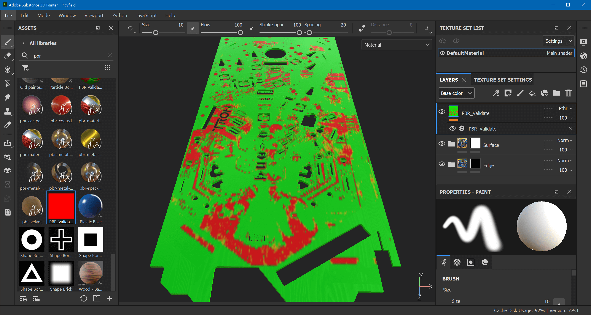

Red means there's a problem. This is most definitely the playfield's albedo that is too dark. Adding a *Levels* effect to the ink's albedo and pushing up the lower boundary to `0.01` already solves most of the problems.

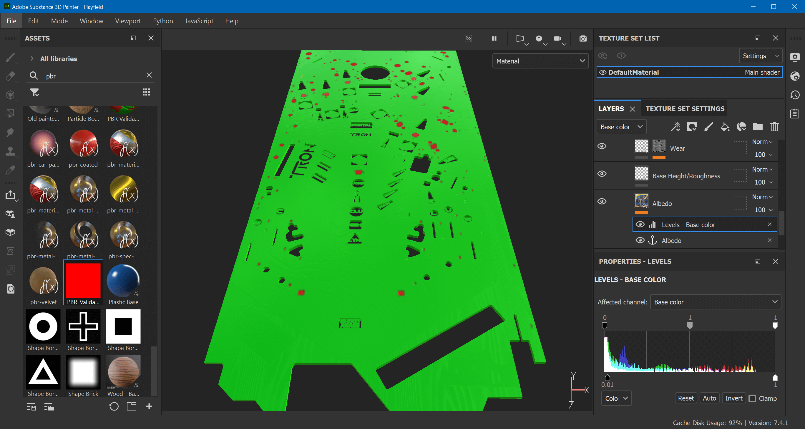

The rest seems related to the fake holes. Looks like `#050505` was way too dark. Pushing up to `#1E1E1E` turns the rest of the playfield green.

## Export

First of all, if you have come so far, congrats. That was quite a ride. The rest is a lot easier.

What Unity needs is a set of maps. In HDRP, those maps are the base map (aka albedo), a [mask map](https://docs.unity3d.com/Packages/com.unity.render-pipelines.high-definition@12.1/manual/Mask-Map-and-Detail-Map.html), and a normal map. Substance Painter can generate those automatically.

However, since Painter usually deals with multiple materials, it will add the material name into each map's file name. For the playfield, we don't want that, because we only have one material.

If you go to *File -> Export Textures*, a dialog pops up where you can edit the output templates. Click on the tab called *Output Templates*, and find the one called *Unity HD Render Pipeline (Metallic Standard)*. Click the *duplicate* icon on the top, and double click the copy to rename. I just called it *Unity HDRP*. Rename the three maps to:

- `$mesh_BaseMap(_$colorSpace)(.$udim)`
- `$mesh_MaskMap(_$colorSpace)(.$udim)`
- `$mesh_Normal(_$colorSpace)(.$udim)`

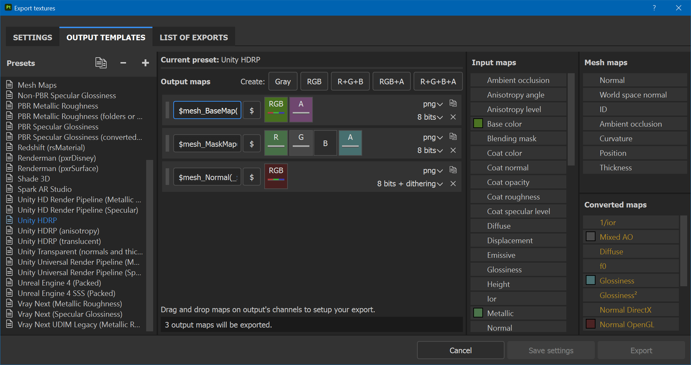

I've removed the fourth map, the emissive map, because we don't need it.

Hit *Save Settings* to close, because we want to do one last thing before exporting. In the *Texture Set Settings* panel, disable the lock icon and set the texture resolution to 2048×4096. This will not squeeze your 2:1 playfield into a 1:1 texture anymore, but use a more appropriate aspect ratio.

Now, to export, click again on *File -> Export Textures*, select the folder where you want to put your textures in (usually in your Unity project folder at `Assets/<table name>/Textures`), change the output template to *Unity HDRP* (the one you created before), and hit *Export*.

> [!note]
> If you happen to have an 8K playfield scan, you can set the *Size* to `8192` before exporting. This will write your maps at 4096×8192.

On first sight, the result doesn't look like much, so let's bring this into Unity!
