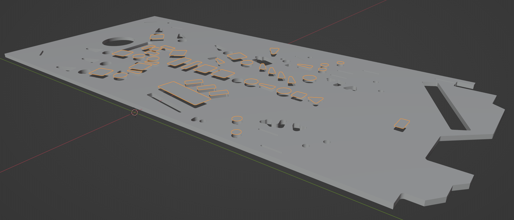

# Create a Realistic Looking Playfield

Every table build starts with the playfield. You'll be looking at it a whole lot of time, so let's make it worthwhile. We'll use Photoshop to create the albedo source texture, Adobe Illustrator to mask out the materials, Blender to create the 3D model, and Substance Painter for the texturing.

> [!note]
> We're aware that most of the software used here is commercial and not free. While Illustrator can be easily replaced with Inkscape and Photoshop by any pixel-based image editor, there isn't a good free alternative for Painter yet. Good news is that Blender will invest significantly in texturing tools this year (2022), but until then, you may be able to use the trial version of Painter. There is also a [non-subscription based version at Steam](https://store.steampowered.com/app/1775390/Substance_3D_Painter_2022/).

Technically, the playfield is purely for visualization, i.e. its geometry doesn't affect gameplay in any way. The advantage of VPE over Visual Pinball is that material properties such as reflection apply to all objects equally, so there is no need for a special "playfield object".

In this tutorial, we'll assume that your playfield is flat. If that's not the case and you'll need a custom mesh for ball collision, we will provide an extension of this tutorial in the future.

## Overview

The result of this workflow are two GameObjects. The first is the wood with holes cut out for inserts and where otherwise visible. The geometry is watertight and the material is solid.

The other GameObject contains the printed ink above the inserts. It consists of polygons that fit perfectly into the insert cut-outs of the wood. Its material uses the same textures as the wood, but it's translucent.

<small><i>The highlighted polygons represent the ink, elevated for illustration purposes (they will be co-planar with the playfield surface).</i></small>

The material we'll be creating takes into account the different surface types of the wood and the ink, irregularities of the ink as well as some micro scratches. We won't get too much into adding wear, tough.

We'll be using the Limited Edition of Stern's *Tron: Legacy* as an example. It has two additional properties you might not see on every table: Mylar protection stickers on the playfield and silver paint around the inserts. We'll cover these on a page separate from the main tutorial.

<small><i>The final result in Unity.</i></small>

## Prerequisites

- A playfield scan. It should be at least 2000×4000 pixels of size, and of decent quality, meaning that dust and other artifacts from the scan should have been removed. It doesn't have to PBR-valid, since we'll be dealing with that in Substance Painter.
- You should be familiar with a vector graphics software such as Adobe Illustrator and have basic Photoshop skills.
- You should know your way around in Blender. Beginner level is fine, but you should be able to navigate in the viewport, transform objects, know what UV-mapping is and know the basics about modifiers.
- You should have a basic understanding of how Substance Painter works, i.e. what layers and effects are and how they blend together.

## Workflow

1. [Create albedo texture and masks](xref:tutorial_playfield_1)
3. [Create the mesh in Blender](xref:tutorial_playfield_2)
3. [Texture the mesh in Substance Painter](xref:tutorial_playfield_3) ([Mylar and silver guide](xref:tutorial_playfield_3b))
4. [Import mesh and material into Unity](xref:tutorial_playfield_4)
