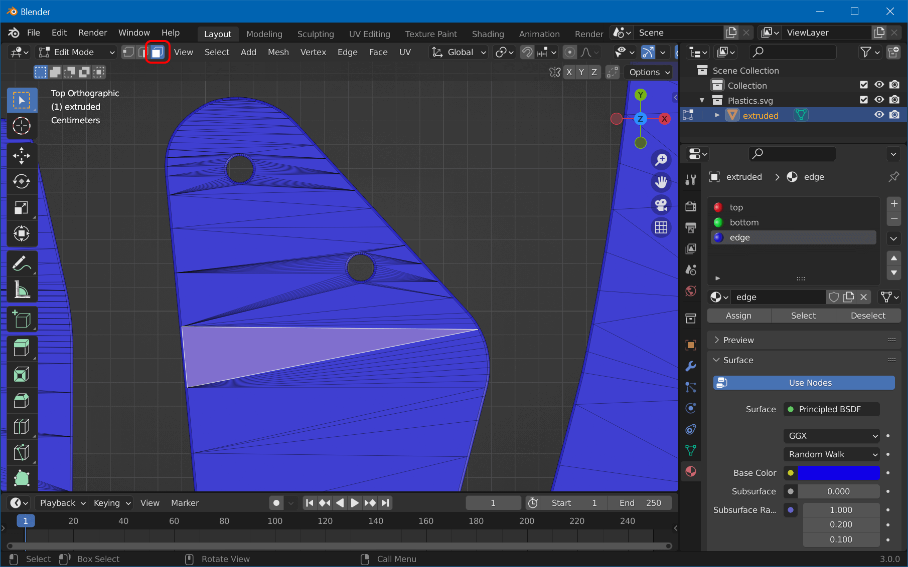
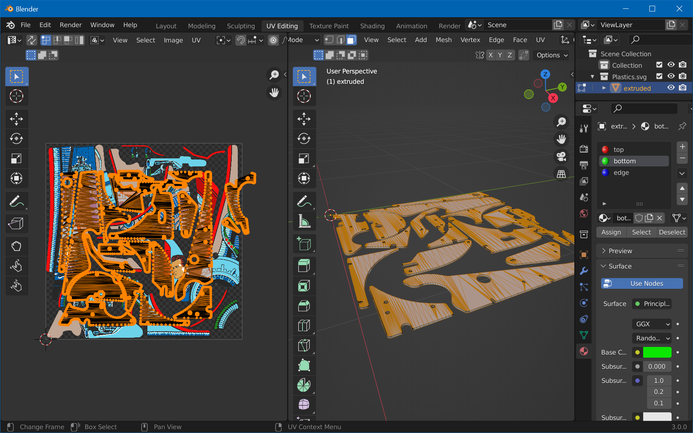
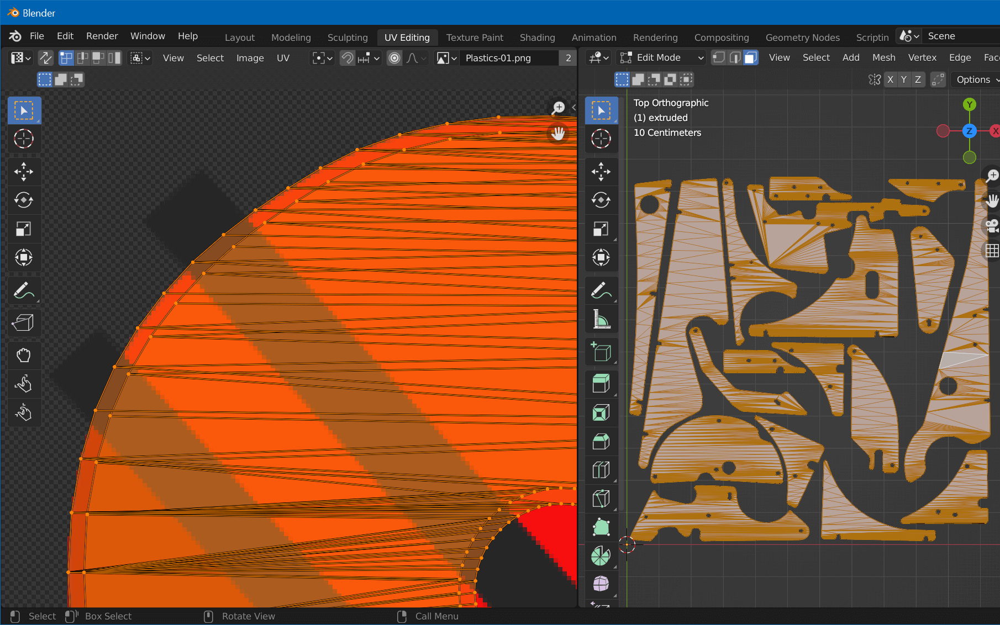

# UV-Map Mesh

## Step 1: Create Material Slots

 We need three material slots, for the top and bottom faces, as well as for the edges. We'll split the vertices by firstly assigning everything to an "edge" slot, and the re-assigning the top and bottom faces to their own slots.

In object mode, open *Materials* properties and remove the current material slot (hit `-`). Add three new slots (press 3× `+`), and for each slot, create a new material by hitting the *New* button when the slot is selected. Name them "top", "bottom" and "edge" and set their base color to red, green and blue respectively. Your slots should now look like in the screenshot.

Set the 3D viewport to *Material Preview*. Select your mesh, press `Tab` to switch to edit mode. Press `A` to select all vertices, select the "edge" material slot, and hit *Assign*. Your plastics should turn blue. Press `A` twice to deselect everything.

Then, press `7` on the numpad to switch to top view, zoom in a bit so you can clearly see the triangles, switch to *Face Select* and click on one face of the top surface:

Click on *Select -> Select Similar -> Coplanar*, which should result in all top faces of all plastics being selected (but *not* the bottoms ones). However, you might get the bottom faces selected too, because there's a threshold that might be too large. You can check it by rotating the camera and verify that the bottom faces are not selected. If they are, expand the parameters and set the threshold to a small enough value. Then, select the "top" material slot and hit *Assign*. The top surfaces should turn red.

For the bottom faces, hit `7`, `9` on the numpad to switch to bottom view, and select again one face. Like before, select all coplanar faces, click the "bottom" material slot, and *Assign*. You should see the bottom faces turn green.

Now, the "edges" material slot should only contain the edges. Check by unselecting all (`A` `A`), then selecting the "edge" material slot and hitting *Select*. This should only select the edges, like here:

Your meshes should now be colored like this (from top / bottom):

## Step 2: UV-Map

Switch to the *UV Editing* workspace. In the left *UV Editor*, choose *Image -> Open*, and select the exported `Plastic-01.png` you've created in part one. On the right, enter edit mode, click on the "top" material slot in the *Materials* property tab, and hit *Select*. Click on "bottom" and then on *Select* again.

From the *UV* menu, select *Cube Projection*. Move your cursor to the left view and press `A`. You should see both the top and bottom surfaces projected onto your texture:

We're now going to align the projection with the texture. You can do that by using the `G` and `S` keys. What's important is to align the **outer** contour with the texture, like so:

## Step 3: Prepare and Export

Once done, switch back to the *Layout* workspace. Before we export, there's still a bit of a clean up to do. In edit mode, hit `A` to select all and choose *Mesh -> Clean Up -> Limited Dissolve*. Exit edit mode, go to *Modifier Properties*, add the *Triangulate* modifier, and hit `Ctrl`+`A` to apply.

What we just did reduced the complexity of our topology. We triangulate at the end to avoid problems during export. 

From left to right: 
- Original (102k vertices, 44k triangles)
- After limited dissolve (66k vertices, 30k triangles, but errors in mesh)
- After triangulation (66k vertices, 30k triangles)

Switch to the *Object Data* properties, and under *Normals*, enable *Auto Smooth*. This will properly align the normals on the bevel side, giving it a more realistic refraction effect.

We still have one single object, so before exporting, let's split it. In edit mode, hit `A` to select all and choose *Mesh -> Separate -> By Loose Parts*. Before exporting, feel free to rename your objects in the Outliner, it's what you'll see in Unity.

Lastly, in object mode, hit `A` to select all objects and click on *Object -> Set Origin -> Origin to Geometry*. This will set the local origin of each object to the object itself, making it easier to place it.

Export the plastics by selecting *File -> Export -> FBX*. Name it `Plastics.fbx` and hit *Export FBX*.

Now let's [import this into Unity](xref:tutorial_plastics_4)!